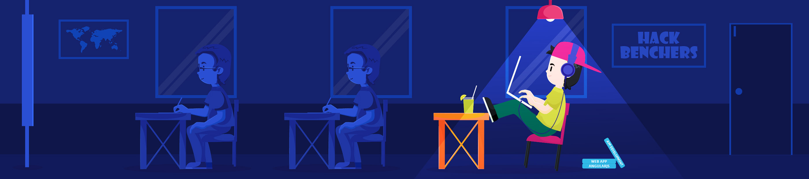

<h1 align="center">Hi 👋, I'm Ashish</h1>
<h3 align="center">A passionate learner from India</h3>

 
   

---

### About Me

- 🔭 I’m currently improving my old projects.
- 🌱 I’m currently learning **Machine Learning** and **Python**.
- 💬 Ask me about **Java**, **Spring Boot**, and the **MERN Stack**.
- 📫 How to reach me: [LinkedIn](https://www.linkedin.com/in/ashish290104/)
- 💼 [My Resume](1_Aug_2024.pdf)

---

### Skills

- **Programming Languages:** Java (Competitive Programming), Python, JavaScript
- **Frameworks & Libraries:** Spring Boot, React, Node.js, Express , Flask , Django
- **Databases:** MySQL, MongoDB
- **Tools & Platforms:** Git, Docker, GitHub

---

### Projects

1. **Supply Chain Management System**
   - Description: Streamlined the E‐Commerce ordering process, inventory management, and delivery logistics, optimizing the flow from order placement to final delivery and ensuring efficient resource allocation (Knapsack Algorithm).
   - Tech Stack: Java Spring Boot, ReactJS, JWT, Flask, NodeJS.
   - [Live]()
   - [Frontend](https://github.com/21CEUOS101/ims_frontend)
   - [Admin](https://github.com/21CEUOS101/IMS_Admin)
   - [Backend](https://github.com/21CEUOS101/IMS_BackEnd)

2. **University Management System**
   - Description: Developed a University Management System for HODs, admins, T&P Cell Operators, Time Table Operators, faculty, and students.
   - Tech Stack: MERN Stack
   - [Live](https://dms2901.netlify.app/)
   - [Frontend](https://github.com/21CEUOS101/dms_frontend)
   - [Backend](https://github.com/21CEUOS101/UMS_BackEnd)

---

### Connect with Me

  &nbsp;&nbsp;
  &nbsp;&nbsp;
  

---

### GitHub Stats

  

  

  

---

### Recent Blog Posts

- 

---

### Support

If you like my work, consider buying me a coffee!

